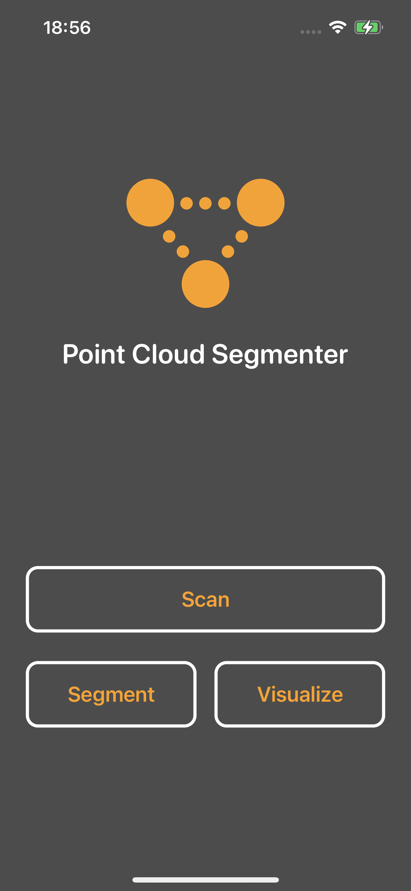
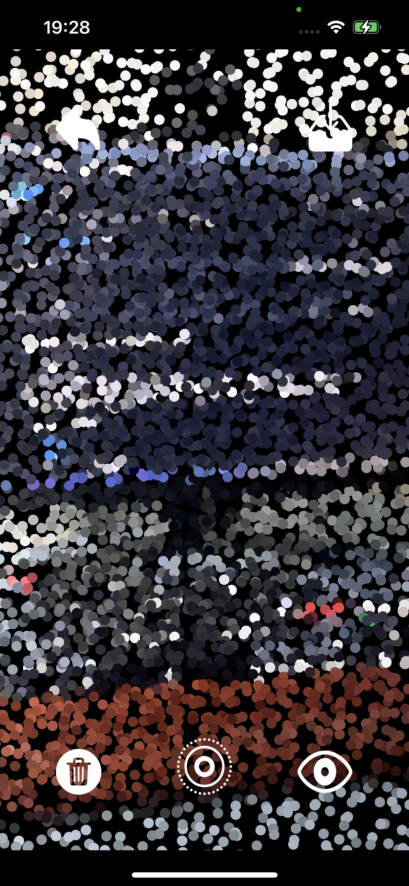
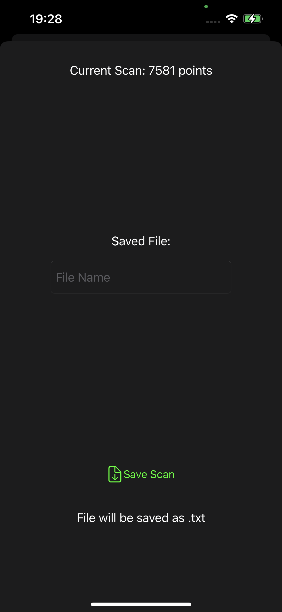
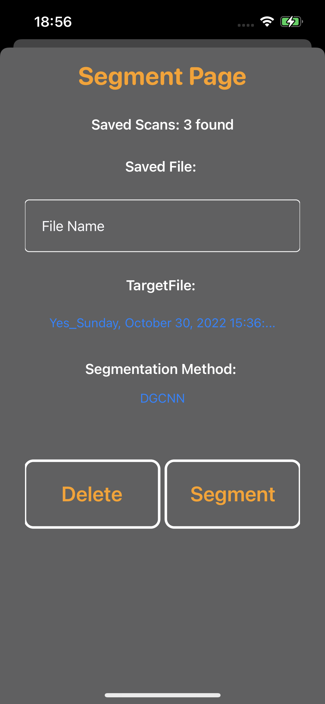
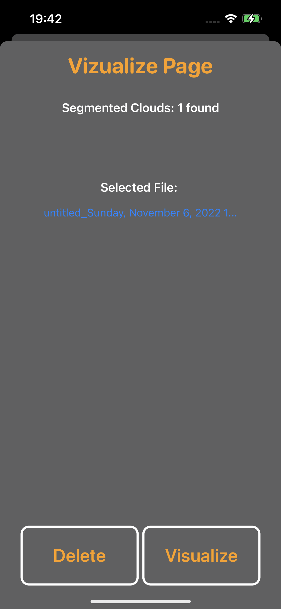
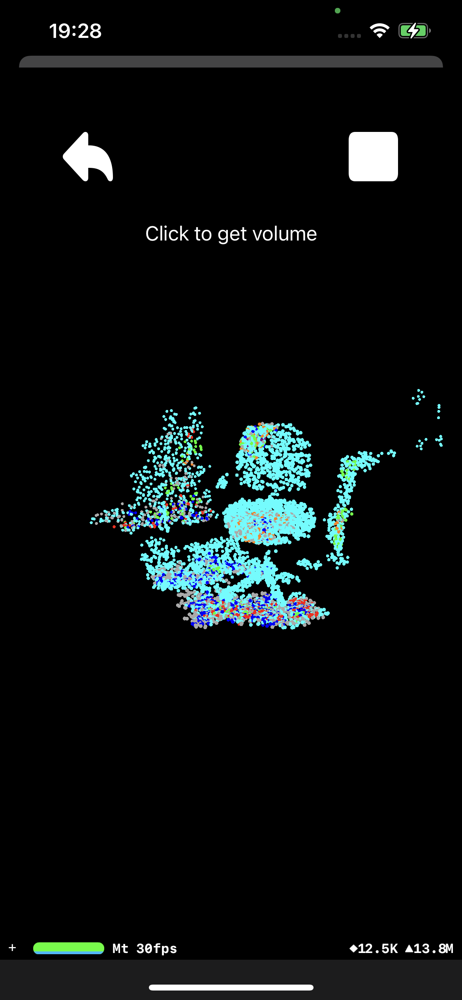
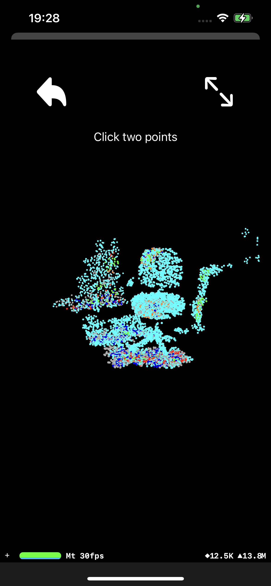

# Iphone Point Cloud Segmenter

## Description
An iOS app that can be used to scan points in the real-world using the scene's depth data and save it to text. It then can segment the scanned points and visualize to get distance between objects and volume of objects. It segments using the AI with two different available methods, Dynamic Graph CNN and Point Transformer + Contrast Boundary Learning. It then separates the result for each class and, using convex hull, approximates the volume of each objects.

## Necessary Libraries
- [Python iOS](https://github.com/kewlbear/Python-iOS)
- [NumPy iOS](https://github.com/kewlbear/NumPy-iOS)
- [Open3D iOS](https://github.com/kewlbear/Open3D-iOS)
- AlamoFire (installed via CocoaPods)

## Installation Steps
- Install cocoa pods
- Navigate to the project directory then setup, init, and install the pod
- Open xcode workspace file generated using xcode
- Install necessary library by pointing them to each link using master branch
- Setup your own certificate and phone (must have LIDAR)
- Set your target device and run

Author does not have an apple developer account, thus cannot distribute the app in any other form.

## Features
### Main menu

- Scan Button: Takes you to the scan page
- Segment Button: Takes you to the segment page
- Visualize Button: Take you to the visualize modal

### Scan Page

- Back Arrow Button: Go back to main menu
- Down Arrow Button: Go to save scan page
- Dumpster Button: Delete current scan
- Middle Circle Button: Start/pause scan
- Eye button: Toggle real world view

### Save Scan Page

- Slide Down: Go back to the main menu
- Current Scan: How many points current scan has
- File Name: What the file will be named after scan
- Save Scan Button: Save current scan

### Segment Page
'

- Slide Down: Go back to the main menu
- Saved Scans: Number of scan currently saved on device
- File Name: What the file will be named after segmentation
- Target File: Chosen file for segementation
- Segmentation Method: Chosen method for segmentation
- Delete Button: Delete currently selected file
- Segment Button: Perform segmentation on target file

### Visualize Modal

- Slide Down: Go back to the main menu
- Segmented Clouds: Number of segmented scan currently saved on device
- Selected File: Chosen file for visualization
- Delete Button: Delete currently selected file
- Segment Button: Perform visualization on currently selected file

### Visualize Page

- Back Arrow Button: Go back to the main menu
- Square Button/Expanding Arrows Button: Choose between two modes, square button for volume and expanding arrows button for distance between two points
- Click on any point: Depending on the mode, this either gets the volume of the chosen class of cloud or distance between two clicked points

## Disclaimer
Base App was taken from https://github.com/ryanphilly/IOS-PointCloud

## Added Functionality
 - Segmentation of objects with multiple methods
 - Get volume of objects and distance between objects
